## 👋 Hi, I'm Enkhtur

Product-focused software engineer with 10+ years of experience building and evolving production systems. I specialize in backend development but work as a **generalist** — owning features end-to-end, making product trade-offs, and shipping real user-facing systems.

I value long-term ownership, fast iteration, and learning from real-world consequences of technical decisions.

<!-- ---

## 🧠 What I Do Best

- Own backend systems over multiple years, iterating based on production usage and real feedback  
- Design and evolve APIs and data models with a focus on correctness, performance, and clarity  
- Ship features independently in ambiguous, fast-moving environments  
- Debug and resolve production issues end-to-end  
- Balance engineering quality with product speed and constraints   -->

---

## 🚀 Current Focus

### Founder & Product Engineer — **msngrbot.com**
A Messenger-based booking product for small businesses (salons, clinics, barbers).

- Designing product flows to minimize onboarding friction  
- Building backend APIs, scheduling logic, and messaging workflows  
- Making product and technical trade-offs based on early usage and constraints  
- Operating the product in production and iterating quickly  

---

## Current Projects

- [inteview-aloud](https://interview-aloud.tech) - An open-source tool to help software engineers practice technical interviews by mimicking out loud.
- [nx-caching-server](https://enxtur.github.io/nx-caching-server) - An open-source caching server for Nx build system to speed up CI/CD pipelines.

---

## 🏗️ Professional Experience

### Senior Backend Engineer — UNOPS / Humanitarian Programme Cycle (HPC)

- Owned and evolved core backend APIs used in humanitarian planning and monitoring workflows over 3+ years  
- Designed embedded calculations and data models consolidating People in Need, funding, and response metrics  
- Iterated on long-lived systems based on production behavior, improving reliability and performance  
- Took responsibility for production issues, debugging complex data and shipping safe fixes  

---

## 🛠️ Tech & Skills

- **Languages:** TypeScript, JavaScript, SQL  
- **Backend:** Node.js, REST APIs, data modeling  
- **Databases:** PostgreSQL  
- **Product & Delivery:** feature ownership, iteration, trade-offs, user feedback loops  
- **Infra & DevEx:** Docker, CI/CD, testing, production debugging  

---

## 🌍 Availability

- Comfortable overlapping with **EU (CET)** and **US** time zones  
- Interested in **product-driven, early-stage or growth-stage startups**  
- Open to remote-first teams  

---

If you’re building a product and care about ownership, speed, and real impact — happy to connect.

<picture>
  <source
    srcset="./profile/stats-dark.svg"
    media="(prefers-color-scheme: dark)"
    height=200 align="center"
  />
  <source
    srcset="./profile/stats.svg"
    media="(prefers-color-scheme: light), (prefers-color-scheme: no-preference)"
    height=200 align="center"
  />
  
</picture>
<picture>
  <source
    srcset="./profile/top-langs-dark.svg"
    media="(prefers-color-scheme: dark)"
    height=200 align="center"
  />
  <source
    srcset="./profile/top-langs.svg"
    media="(prefers-color-scheme: light), (prefers-color-scheme: no-preference)"
    height=200 align="center"
  />
  
</picture>