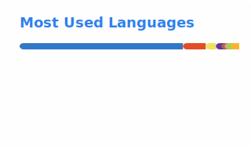

## 👋 Hi, I'm Enkhtur

I'm a software engineer with 10+ years of experience, mostly working on backend systems. I usually take a generalist approach — picking up whatever is needed to move a product forward and seeing features through from idea to production.

I care about building things that are useful, maintainable, and shaped by real usage rather than theory.

---

## Current Projects

- [landing-kit](https://enxtur.github.io/landing-kit) — Disruptive landing page builder… just kidding. It’s a tiny Next.js wrapper that lets you build a landing page from a single config.ts
- [msngrbot.com](https://msngrbot.com) — A Messenger-based booking tool for small businesses (salons, clinics, barbers).
- [nx-caching-server](https://enxtur.github.io/nx-caching-server) — A small open-source caching server to speed up Nx-based CI/CD pipelines.
- [interview-aloud](https://interview-aloud.tech) — An open-source tool to help developers practice technical interviews by speaking answers out loud.

---

## Legacy Contributions

- [HPC](https://humanitarianaction.info) - A humanitarian programme cycle management system for UN OCHA
- [FTS](https://fts.unocha.org) - A financial tracking system for UN OCHA
- [UB Info](https://ubinfo.mn/app) - Daily news aggregator for the Mongolian news websites

---

<picture>
  <source
    srcset="./profile/stats-dark.svg"
    media="(prefers-color-scheme: dark)"
    height=200 align="center"
  />
  <source
    srcset="./profile/stats.svg"
    media="(prefers-color-scheme: light), (prefers-color-scheme: no-preference)"
    height=200 align="center"
  />
  
</picture>
<picture>
  <source
    srcset="./profile/top-langs-dark.svg"
    media="(prefers-color-scheme: dark)"
    height=200 align="center"
  />
  <source
    srcset="./profile/top-langs.svg"
    media="(prefers-color-scheme: light), (prefers-color-scheme: no-preference)"
    height=200 align="center"
  />
  
</picture>

---

## 🛠️ Tech & Skills

- **Languages:** TypeScript, JavaScript, SQL  
- **Backend:** Node.js, REST APIs, data modeling  
- **Databases:** PostgreSQL, MongoDB
- **Ways of working:** feature ownership, iteration, debugging production issues  
- **Infra & tooling:** Docker, CI/CD, testing  

---

## 🌍 Availability

- Comfortable overlapping with **EU (CET)** and **US** time zones  
- Interested in **product-focused teams** and early-stage environments  
- Open to remote-first work  

---

If you’re working on a product and looking for someone who enjoys steady progress and ownership, feel free to reach out.
